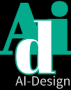

# AID | AI-Design

<div>
    <p align = "center">
	    
    </p>
</div>

## Overview
---

- 문제 및 해결 방안

    저희는 업사이클링 시장의 고충과 특성인 업사이클러의 불안정한 소재 수급이 불안정한 점, 대부분 5인 이하의 영세 규모인 점 등을 해결하기 위한 솔루션을 제시했습니다.

    <b>AID는 국내 에코 크리에이터들과 소비자를 이어주는 1:1 온라인 맞춤형 서비스 입니다.</b>

    소비자가 가진 폐의류의 스타일을 반영하고, 디자이너의 이미지를 합성하여 해당 폐의류의 업사이클링 디자인 예상도를 미리 제안합니다.
 
    첫번째 불안정한 소재 수급의 문제는 소비자의 폐의류로 직접 소재 제공을 한다면 보다 안정적인 소재 수급이 될 것이고,
    두번째 본래 수도권 중심의 제품 유통의 업사이클링 문화를 온라인으로 활성화 시킬 생각입니다.
    세번째는 주로 업체 규모가 5인 미만의 영세 규모로 구성되어있는 시장 현황을 반영해 소비자와 디자이너의 1:1 매칭 형태를 생각했습니다. 
    이를 바탕으로 전국적으로 더욱 확장된 업사이클링 문화를 이룰 수 있도록 합니다.

## 기능 소개
---
>앱 영상을 gif로 넣기
## 기대 효과
---
업사이클링 시장에 안정적인 재료 수급과 판로 제공을 하고, 디자이너가 다양한 디자인을 선보일 수 있는 기회의 창을 제공할 수 있습니다. 또한 업사이클링 소재 데이터 확보를 통해 업사이클 가능 여부를 판별하는 AI가 발전할 수 있고, 에코크리에이터-폐기물 배출기관과의 소통 문제도 해결 가능할 것으로 기대합니다.

## How to Execute
---
- Django Backend API
```
[settings]
Request conf.yaml from Administartor
Move conf.yaml to directory 'CMMApi/'

[Terminal]
pip install -r requiements.txt
python manage.py runserver
```

## API
- User Manage
```
[login]
/rest-auth/login/

[register]
/rest-auth/register/

[logout]
/rest-auth/logout/
```
