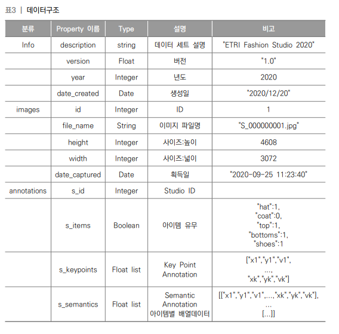
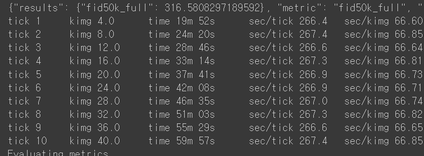
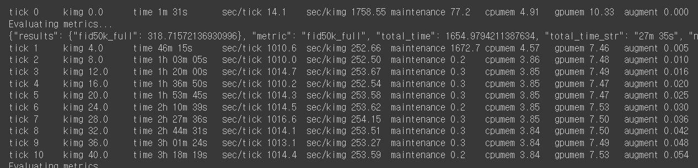
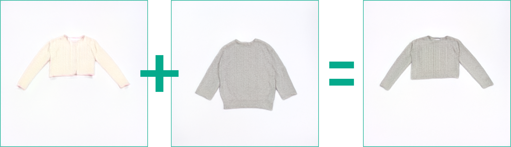

# AI Readme

This repository modified the code from StyleGANv2-ada-pytorch(https://github.com/NVlabs/stylegan2-ada-pytorch). \
After several studies(issues), the most parameters were selected. 

### 1. Data Gathering \

- We selected "패션 상품 및 착용 이미지" Dataset that provided from AI-hub(https://aihub.or.kr/aidata/30755)
 \
  (* The Graph was taken from the AI-hub)
  
- DATA INFO(summary)
  > height : 1280 \
    width : 720 \
    Item-type(s_items) : top, bottoms, coat (hat, shoes types are excluded)
    Data_Size : 50,000+ images
    
    
### 2. Data Pre-processing

#### 1) <i>Data Extract</i>
    Extract Data from Raw AI hub data what we need, using json files (type : coat, top, bottoms)  

#### 2) <i>Image Cropping</i>

    Cropped (720x1280) size to (720x720) which does not damage the original of the Raw Image Dataset

#### 3) <i>Image Resizing</i>

    Resize 720x720 size to three ways *256x256, *512x512, *1024x1024
    Due to the limitations of the GPU, image of 256x256 size was selected
* The codefor the following preprocessing is included in the c_data_preprocessing.ipynb

### 3. Training
#### 0) Environments
- Trained StyleGANv2 in <b>Colab-Pro</b> environments 
  > GPU : Tesla T4\
  RAM : 32GB\
  gpus : 1
  
#### 1) Train
- Train 256x256 Duration
      
  
- ~~Train 512x512 Duration~~
    

    (Due to the limitations of the GPU, a 256x256 image was finally selected.)  
- Main Parameter
    >kimg : about 3000+ \
     cfg : const
     
- Generator(Projector.py)
  

#### 2) Output
 
